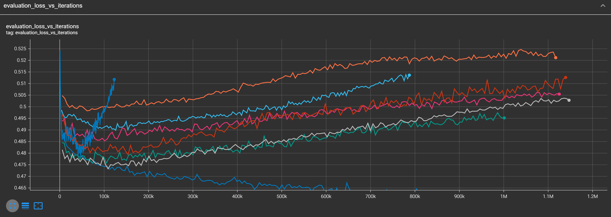
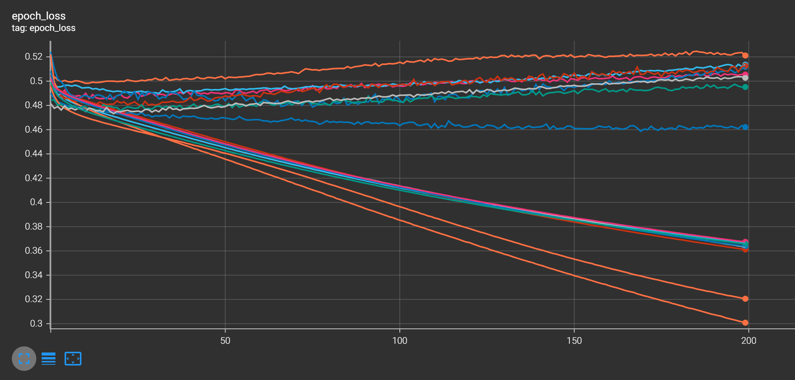

# WinPredictor

## Description
A league of legends desktop app and website that uses AI to calculate a persons chances of winning the game. The website uses an offline api which allows the user to use the win predictor asynchronously. Should the user download the app to their computer, it will use Riot Game's live game data api to automatically extract information about the current game and use it to make much more accurate predictions about the players current chance of winning the game they are playing. This can be useful for determining how impactful a certain play they did and how it affects their chances of winning the game. The results may be surprising so it could be a useful tool for those looking to improve.

## Performance
Here are a few charts that show the learning progress of the models(1 per rank):

## Training

### Dependencies:

First, make sure you have these dependencies installed:

- Tensorflow
- Pandas
- Matplotlib

Once you have installed the dependencies follow these instructions:

1. Clone the repository `git clone https://www.github.com/fqhd/WinPredictor`
1. Run `python3 download_training_data.py` to download the training data locally. It should appear in a folder called `data`.
1. Next, parse the training data into tensors so that they are easy to load into memory when training the AI `python3 parse_training_data.py`
1. Finally, you can fully train the AI with `python3 train.py`. The models should appear in a directory called `models` in H5D5 format.

## TODO
- Live game data Model
- Live win predictor API
- Kaggle dataset
- Download dataset from kaggle
- Electron App
